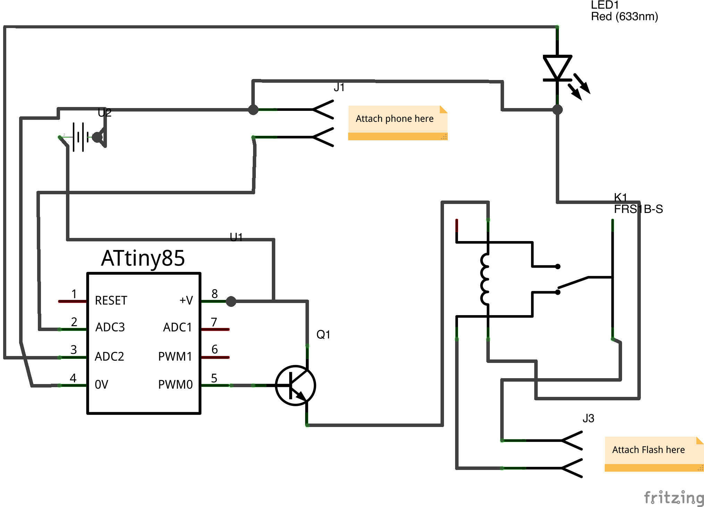
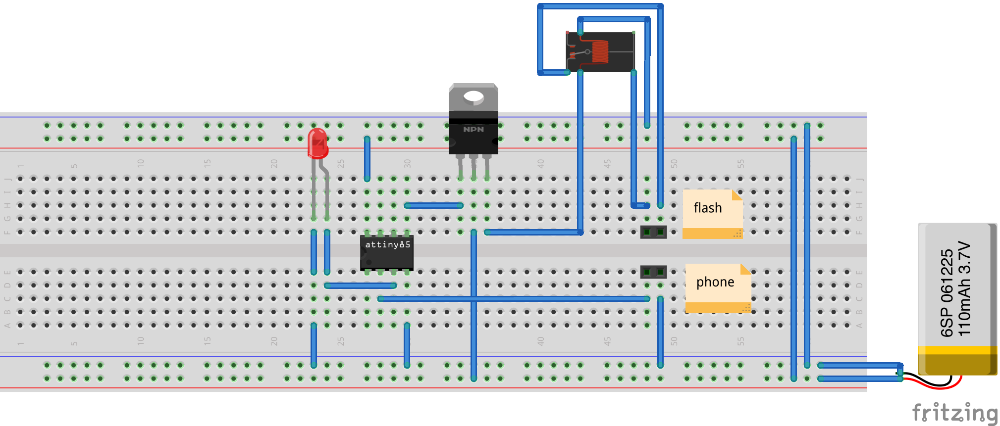

# Headphone to Arduino

This setup allows you to trigger a camera flash from your phones' headphone jack with a short sound impulse.

[add project url]

## Setup

Using Javascript and the Web Audio API, 50ms long sound impulses are sent from a webpage running on the phone.
An ATtiny85 microprocessor is listening for audio input (voltage changes) from a phone headphone jack connected via a simple audio cable.
When the microprocessor is connected, it connects the two wires of a flash synchron cable and thereby triggers the flash.

The flash needs some seconds to reload after it has been triggered. Impulses arriving in the meantime are added to a flash queue, where they wait until the flash has reloaded. The LED is on as long as there are impulses waiting in the queue.

[add link to CA ATtiny tutorial]

## Parts needed
- Camera Flash with synchron cable (I'm using an Unomat 20B auto)
- ATtiny85 microprocessor, Arduino or similar
- Power supply, e.g. LIPO 3.7V 110mAh battery
- Transistor, e.g. BD 137-16
- Relay, e.g. FRS1B-S
- audio cable that fits your phone's audio output

## Circuit Design
Since flash circuits usually carry high voltages (180V in my case), the circuit has to be isolated from your microprocessor and headphone jack. This is accomplished by using a relay.
Because the current from the ATtiny output pin is too weak to drive the relay, I'm using a transistor.

Here's the circuit and a breadboard example:

Author: Philipp Schmitt  
Contact: mail@philippschmitt.com
